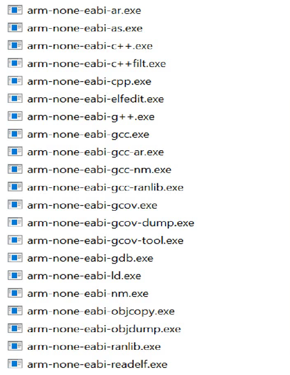

# Toolchain
A set of specialized tools, each doing **one stage** of turning C/C++ code into something your MCU can run.
```bash
C/C++ → preprocess → compile → assemble → link → inspect → flash/debug
```

Here gives an example about ARM embedded GNU toolchain



arm-none-eabi- means:
- **arm** → target architecture
- **none** → no OS
- **eabi** → Embedded ABI (bare metal)

## Front-end / compiler drivers
`arm-none-eabi-gcc.exe`  
**The boss / driver program**

- Calls **cpp**, **cc1**, **as**, **ld** for you
- Decides the pipeline based on flags

```bash
arm-none-eabi-gcc main.c          # full build
arm-none-eabi-gcc -E main.c       # preprocess only
arm-none-eabi-gcc -S main.c       # compile → assembly
arm-none-eabi-gcc -c main.c       # assemble → .o
```

You almost always use **this**, not the lower-level tools directly.

## Preprocessor
`arm-none-eabi-cpp.exe`

## Compiler (hidden but important)
You don’t see `cc1` in your list, but internally:
```bash
gcc → cc1 → assembly
```

## Assembler
`arm-none-eabi-as.exe`
```bash
arm-none-eabi-as startup.s -o startup.o
```

## Linker
`arm-none-eabi-ld.exe`

**One of the most critical tools in embedded**

```bash
arm-none-eabi-gcc main.o startup.o -T linker.ld -o app.elf
```

## Binary inspection & analysis (debugging gold)
`arm-none-eabi-nm.exe`

Shows symbols:
```bash
arm-none-eabi-nm app.elf
```
- seeing what got linked
- checking symbol sizes

`arm-none-eabi-objdump.exe`

Disassemble and inspect sections:
```bash
arm-none-eabi-objdump -d app.elf
arm-none-eabi-objdump -h app.elf
```

`arm-none-eabi-readelf.exe`

Reads ELF metadata:
```bash
arm-none-eabi-readelf -S app.elf   # sections
arm-none-eabi-readelf -r app.elf   # relocations
```

## Format conversion (for flashing)
`arm-none-eabi-objcopy.exe`

Converts ELF → binary/hex:
```bash
arm-none-eabi-objcopy -O binary app.elf app.bin
arm-none-eabi-objcopy -O ihex   app.elf app.hex
```
Your MCU usually gets **`.bin`** or **`.hex`**, not `.elf`.


## Debugger
`arm-none-eabi-gdb.exe`
```bash
arm-none-eabi-gdb app.elf
```


